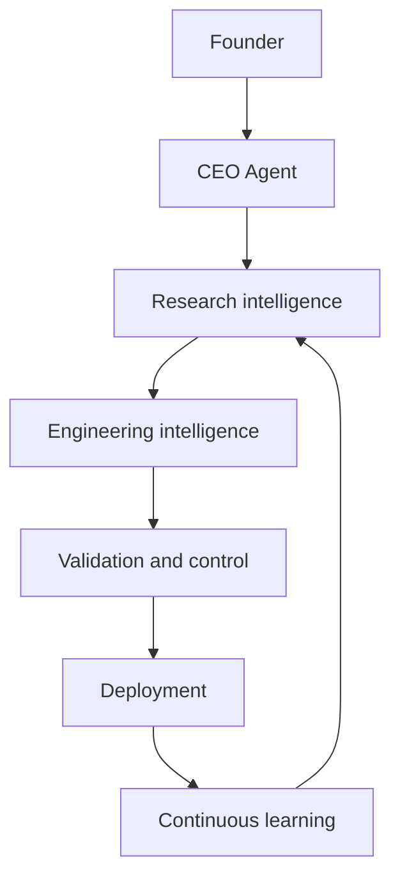
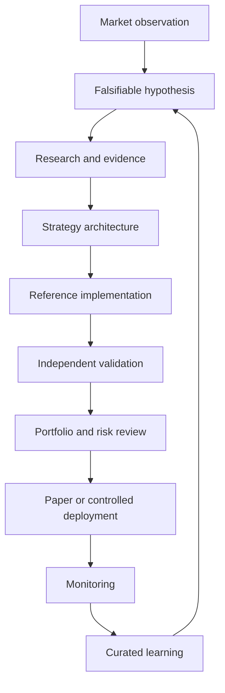

# AI Quant Lab Master System Design

## Document control

| Field | Value |
|---|---|
| Document class | Highest-level intelligence architecture specification |
| Status | Proposed for Sprint 2 review |
| Authority | All future agent mandates, workflows, and knowledge systems derive from this document |
| Scope | Research intelligence, decision authority, knowledge flow, validation, deployment, and learning |
| Out of scope | Runtime topology, programming language selection, database selection, and infrastructure procurement |
| Change control | Architectural review and explicit Founder approval |

This specification defines how AI Quant Lab reasons, delegates, verifies, decides, remembers, and improves. It is not a software component diagram. Implementations may change; the intelligence boundaries and evidence obligations defined here remain stable unless this document is versioned through formal review.

## 1. System philosophy

### 1.1 Purpose

AI Quant Lab exists to transform uncertain market observations into controlled, reproducible decisions about systematic trading strategies. Its function is not to maximize the number of strategies produced. Its function is to maintain the integrity of the process by which strategies are proposed, tested, rejected, promoted, monitored, and retired.

The platform addresses a structural problem: quantitative research combines exploration, engineering, statistical judgment, risk control, operational execution, and organizational memory. When one model or person performs all of these roles without explicit boundaries, assumptions become hidden, adverse evidence is discounted, and successful-looking results can approve themselves.

AI Quant Lab separates these incentives. Exploration is allowed to be creative. Implementation must be exact. Validation must be skeptical. Risk must be conservative. Deployment must be controlled. Organizational memory must preserve both successes and failures.

### 1.2 Definition of intelligence

Within AI Quant Lab, intelligence is the capacity to:

1. form a falsifiable explanation from an observation;
2. identify what evidence would support or reject that explanation;
3. select tools and delegate work within defined authority;
4. produce artifacts whose lineage can be inspected;
5. distinguish measured facts, assumptions, inferences, and decisions;
6. revise beliefs when new evidence conflicts with prior expectations;
7. preserve useful knowledge without preserving invalid conclusions;
8. act only when the evidence and authority for action are sufficient.

Intelligence is not measured by fluent output, strategy count, backtest profit, or agent autonomy. An intelligent system must know when evidence is insufficient and stop or escalate accordingly.

### 1.3 Modular intelligence

AI Quant Lab uses specialized agents instead of one monolithic agent because research roles require different objectives, context, and failure tolerance.

A monolithic agent creates four control failures:

- **self-review:** the same reasoning process proposes and approves a conclusion;
- **context contamination:** exploratory assumptions become implicit requirements downstream;
- **authority leakage:** access granted for one task becomes available to unrelated decisions;
- **untraceable revision:** conclusions change without a clear artifact or accountable transition.

Modular intelligence limits these failures. Each agent has one primary purpose, declared inputs, declared outputs, forbidden responsibilities, and named consumers. Agents exchange versioned artifacts rather than shared hidden state. This makes an agent replaceable without redesigning the whole system and allows independent evaluation of each reasoning boundary.

Specialization does not imply isolation. Agents cooperate through common artifact contracts, controlled requests, reviews, and lifecycle events. The unit of coordination is not a conversation; it is a traceable work package.

### 1.4 Reproducible decisions

Every material decision must be reproducible in two senses.

**Computational reproducibility** means the relevant code, configuration, data identity, environment, execution model, and random seeds can recreate the evidence within declared tolerances.

**Decision reproducibility** means an independent reviewer can reconstruct which evidence was available, which policy applied, who or what held authority, how conflicts were resolved, and why a state transition occurred.

The project therefore treats decisions as versioned artifacts. A decision that exists only in chat, memory, or an overwritten file is not a system decision. Reproducibility does not require that another reviewer reach the same judgment; it requires that the original judgment and evidence can be inspected without guesswork.

### 1.5 Research posture

The system assumes that most candidate edges will fail, many apparent improvements will be selection artifacts, market behavior will change, and operational execution will differ from simulation. These are normal conditions, not exceptions.

Accordingly:

- evidence is evaluated in strength order, not presentation order;
- adverse results remain visible;
- complexity requires incremental evidence;
- promotion criteria are declared before final evaluation;
- production authority is narrower than research authority;
- live behavior is treated as new evidence, not proof that earlier models were correct.

## 2. Global system map

### 2.1 Authority hierarchy



This hierarchy describes authority and evidence flow, not human rank or execution order.

### 2.2 Founder

The Founder defines project purpose, acceptable risk, capital authority, ethical and legal constraints, and irreversible strategic choices. The Founder does not tune strategies or selectively waive failed tests. Founder interventions that change policy or override a gate require a versioned decision record.

### 2.3 CEO Agent

The CEO Agent translates Founder policy into research priorities, budgets, lifecycle decisions, and conflict resolution. It controls advancement between major states but cannot rewrite the evidence produced by specialist agents.

### 2.4 Research intelligence

Research intelligence converts market observations and external knowledge into falsifiable hypotheses and complete strategy specifications. It includes the Quant Strategy Architect, Research Librarian, Market Research Agent, Knowledge Curator, and Experiment Agent.

### 2.5 Engineering intelligence

Engineering intelligence converts approved specifications into deterministic reference implementations and platform-specific implementations. It includes the Python Agent and Pine Agent. Engineering does not decide whether its implementation is robust enough for promotion.

### 2.6 Validation and control

Validation and control attempt to disprove candidate quality, verify implementation parity, constrain risk, test portfolio interaction, and assess release integrity. This layer includes Validation, Risk, Portfolio, and QA Agents. Its mandatory gates cannot be bypassed by implementation agents.

### 2.7 Deployment

Deployment converts an approved immutable candidate into a bounded operational release. The Execution Agent acts only on an approved deployment manifest and externally enforced limits. Deployment cannot modify strategy logic, validation criteria, or risk policy.

### 2.8 Continuous learning

Continuous learning converts experiments, paper trading, live telemetry, incidents, validation failures, and market change into curated organizational knowledge. It does not permit online self-modification of production logic. Changes re-enter the research lifecycle as new versioned proposals.

### 2.9 System state model

Every strategy has one authoritative lifecycle state:

```text
OBSERVATION
→ HYPOTHESIS
→ RESEARCH
→ SPECIFIED
→ IMPLEMENTED
→ VALIDATION
→ PORTFOLIO_REVIEW
→ PAPER
→ CANDIDATE
→ DEPLOYED
→ MONITORED
```

Any state may transition to `REVISE` or `REJECTED`. Operational states may transition to `DEGRADED`, `DISABLED`, or `RETIRED`. A state transition requires a defined owner, evidence bundle, policy gate, and decision record.

## 3. Agent ecosystem

### 3.1 Common agent contract

Every agent must declare:

- one primary purpose;
- owned decisions and non-owned decisions;
- accepted input artifact types and schema versions;
- produced output artifacts and quality fields;
- downstream consumers;
- required services, agents, and knowledge;
- forbidden responsibilities;
- detectable failure conditions;
- escalation target;
- authority level and permitted side effects.

An agent must reject unsupported inputs rather than infer missing authoritative fields. Agent output must separate facts, assumptions, inferences, recommendations, and decisions.

### 3.2 CEO Agent

**Purpose:** govern the research portfolio and authorize lifecycle transitions.

**Responsibilities:** set priorities and compute budgets; select research questions; resolve cross-agent conflicts; approve `PAPER`, `CANDIDATE`, `DEPLOYED`, `DISABLED`, and `RETIRED` transitions; maintain champion/challenger policy; escalate policy questions to the Founder.

**Inputs:** Founder policy, decision requests, strategy specifications, validation reports, risk assessments, portfolio evaluations, QA dispositions, monitoring reports, incident records, and resource telemetry.

**Outputs:** priority queue, authorized work order, budget allocation, lifecycle decision record, exception decision, and escalation record.

**Consumers:** all agents, especially Quant Strategy Architect, Experiment Agent, Execution Agent, and Documentation Agent.

**Dependencies:** complete evidence registry, policy engine, lifecycle state, and independent control reports.

**Forbidden responsibilities:** invent strategy rules; alter research results; run validation; change risk metrics to permit promotion; write execution code; silently override failed gates.

**Failure conditions:** decision without required evidence; unresolved conflict of interest; policy contradiction; budget overrun without escalation; state transition outside authority; repeated preference for favorable evidence over declared criteria.

### 3.3 Quant Strategy Architect

**Purpose:** convert an approved hypothesis into a complete, testable strategy specification.

**Responsibilities:** define market mechanism, universe, timeframe, regime, entries, exits, state transitions, sizing intent, execution assumptions, parameter domains, invalidation criteria, and required tests; minimize unnecessary complexity; maintain strategy-family taxonomy.

**Inputs:** authorized hypothesis, market research report, curated evidence package, historical lessons, market-mechanics constraints, and project policy.

**Outputs:** versioned `StrategySpecification`, rationale map, explicit assumption register, test requirements, and implementation handoff.

**Consumers:** Python Agent, Pine Agent, Experiment Agent, Validation Agent, Risk Agent, and Documentation Agent.

**Dependencies:** Research Librarian, Market Research Agent, Knowledge Curator, canonical schemas, and decision policy.

**Forbidden responsibilities:** select parameters from final holdout performance; implement production execution; validate its own specification; approve deployment; omit unfavorable evidence.

**Failure conditions:** ambiguous rule; unfalsifiable hypothesis; undeclared execution timing; missing invalidation criteria; redundant complexity without evidence; specification that cannot be implemented independently.

### 3.4 Research Librarian

**Purpose:** retrieve and synthesize external and internal evidence for a defined research question.

**Responsibilities:** search approved sources; preserve provenance; classify source quality; identify contradictions; distinguish quotation, source claim, synthesis, and inference; enforce licensing and citation policy.

**Inputs:** research request, source catalog, knowledge policy, access permissions, and prior evidence packages.

**Outputs:** evidence package, annotated bibliography, contradiction register, source gaps, and freshness assessment.

**Consumers:** Quant Strategy Architect, Market Research Agent, Knowledge Curator, Documentation Agent, and CEO Agent.

**Dependencies:** books, papers, official documentation, repositories, experiment registry, and source metadata.

**Forbidden responsibilities:** claim empirical validity without testing; alter source content; treat marketing material as equivalent to primary evidence; approve a strategy; ingest unlicensed material into permanent storage.

**Failure conditions:** missing provenance; unsupported summary; stale critical source; unmarked inference; licensing uncertainty; unresolved duplicate or contradictory source identity.

### 3.5 Market Research Agent

**Purpose:** characterize markets and identify testable conditional behavior without defining the final strategy.

**Responsibilities:** analyze market structure, liquidity, sessions, volatility, trend quality, regimes, cross-asset context, event sensitivity, and execution constraints; generate observations and candidate hypotheses with uncertainty.

**Inputs:** qualified market data, market metadata, Research Librarian evidence, historical results, and a scoped research mandate.

**Outputs:** market research report, observation set, regime analysis, candidate hypotheses, data limitations, and market-mechanics warnings.

**Consumers:** Quant Strategy Architect, Experiment Agent, Portfolio Agent, Risk Agent, and CEO Agent.

**Dependencies:** data quality controls, feature definitions, market calendars, venue metadata, and knowledge sources.

**Forbidden responsibilities:** optimize strategy parameters; convert correlation into causal claim; approve strategy architecture; execute trades; suppress observations inconsistent with the requested thesis.

**Failure conditions:** unqualified data; hidden sample selection; hypothesis written after outcome inspection without disclosure; regime labels without definitions; unsupported market-generalization.

### 3.6 Python Agent

**Purpose:** implement the canonical research behavior and quantitative analysis in a reproducible environment.

**Responsibilities:** implement data pipelines, features, backtests, optimization, metrics, trade ledgers, experiment manifests, and reference strategy behavior; enforce deterministic configuration and seeds; expose testable interfaces.

**Inputs:** frozen strategy specification, dataset manifests, experiment plan, canonical schemas, and engineering standards.

**Outputs:** versioned implementation, locked environment, test suite, experiment artifacts, reference trade ledger, and implementation notes.

**Consumers:** Experiment Agent, Validation Agent, Pine Agent, QA Agent, Risk Agent, and Portfolio Agent.

**Dependencies:** approved data adapters, schema registry, artifact store, test fixtures, and source control.

**Forbidden responsibilities:** change strategy intent without a specification revision; inspect final holdout during implementation; approve statistical validity; deploy or execute trades; hide numerical or data errors.

**Failure conditions:** non-deterministic rerun; implicit cost or timing assumption; leakage; unhandled missing data; mismatch with specification; missing environment or artifact lineage.

### 3.7 Pine Agent

**Purpose:** implement approved strategy behavior for TradingView while preserving declared semantics.

**Responsibilities:** translate frozen rules into Pine Script; document platform constraints; implement alerts and inputs; prevent repainting and look-ahead; export comparable signals and trades; maintain versioned release notes.

**Inputs:** strategy specification, Python reference behavior, Pine documentation, parity schema, and TradingView constraints.

**Outputs:** Pine source, platform assumption report, alert contract, exported trade ledger, and parity candidate package.

**Consumers:** Validation Agent, QA Agent, Documentation Agent, and approved TradingView deployment process.

**Dependencies:** Python Agent reference ledger, official Pine documentation, representative fixtures, and TradingView adapter.

**Forbidden responsibilities:** alter rules to improve TradingView results; conceal platform divergence; use repainting behavior unless explicitly specified for non-trading analysis; approve parity; place broker orders directly.

**Failure conditions:** unexplained trade mismatch; undeclared intrabar behavior; transformed-chart price error; repainting; incompatible alert payload; version drift from specification.

### 3.8 Validation Agent

**Purpose:** independently attempt to invalidate a frozen candidate.

**Responsibilities:** enforce chronology; run Walk-Forward, Monte Carlo, parameter stability, negative controls, multiple-testing defenses, cross-seed, cross-window, cross-market, execution perturbation, and Python/Pine parity tests; issue pass, conditional pass, or fail against predeclared gates.

**Inputs:** frozen specification, implementations, experiment manifests, ledgers, datasets, validation policy, and acceptance thresholds.

**Outputs:** immutable validation report, failure register, robustness distributions, parity report, holdout-access record, and gate disposition.

**Consumers:** CEO Agent, Risk Agent, Portfolio Agent, QA Agent, Quant Strategy Architect, and Knowledge Curator.

**Dependencies:** independent compute path, canonical metric definitions, locked artifacts, and access control for holdouts.

**Forbidden responsibilities:** modify the candidate; tune parameters after final evaluation; relax thresholds after seeing results; approve deployment alone; omit failed folds.

**Failure conditions:** contaminated holdout; incomplete test suite; mismatch between declared and executed policy; non-reproducible report; validator dependence on producer-only state; unclassified parity differences.

### 3.9 Risk Agent

**Purpose:** define and enforce acceptable standalone financial and operational risk.

**Responsibilities:** assess leverage, loss distribution, drawdown, liquidity, funding, margin, concentration, capacity, venue, data, model, and operational risk; specify limits, kill switches, and escalation thresholds.

**Inputs:** validated candidate package, trade distributions, market mechanics, execution model, capital mandate, portfolio context, and risk policy.

**Outputs:** `RiskAssessment`, enforceable limit set, stress report, kill-switch policy, residual-risk register, and risk disposition.

**Consumers:** CEO Agent, Portfolio Agent, Execution Agent, QA Agent, and monitoring process.

**Dependencies:** Validation Agent, market metadata, portfolio exposures, operational controls, and Founder risk policy.

**Forbidden responsibilities:** improve strategy signals; waive validation failures; maximize return; alter capital mandate; depend on strategy code as the only risk control.

**Failure conditions:** unenforceable limit; missing tail scenario; stale liquidity assumption; limit conflict; control dependent on the failing system; unapproved risk exception.

### 3.10 Portfolio Agent

**Purpose:** evaluate how validated strategies interact as a portfolio.

**Responsibilities:** analyze return, factor, regime, signal, and drawdown dependence; estimate marginal risk and concentration; propose allocation bounds; evaluate capacity and rebalancing; test champion/challenger combinations.

**Inputs:** validated strategy packages, risk assessments, capital mandate, historical and simulated joint distributions, live exposures, and liquidity constraints.

**Outputs:** portfolio evaluation, dependency map, allocation proposal, concentration report, portfolio stress results, and eligibility disposition.

**Consumers:** CEO Agent, Risk Agent, Execution Agent, Experiment Agent, and monitoring process.

**Dependencies:** Risk Agent policies, consistent strategy ledgers, market data, and portfolio state.

**Forbidden responsibilities:** approve a statistically invalid strategy because it diversifies; change individual strategy rules; exceed risk limits; assume historical correlation is stable without stress tests.

**Failure conditions:** missing common-factor exposure; incompatible return alignment; unstable allocation; ignored liquidity coupling; portfolio recommendation outside mandate; failure to model simultaneous drawdowns.

### 3.11 Execution Agent

**Purpose:** translate approved deployment manifests into controlled paper or live orders.

**Responsibilities:** validate deployment state; transform signals into orders; enforce limits; manage idempotency, retries, acknowledgments, partial fills, and reconciliation; emit operational events; obey kill switches.

**Inputs:** approved deployment manifest, signed strategy version, current portfolio state, risk limits, market data, broker state, and execution policy.

**Outputs:** orders, acknowledgments, fills, position records, reconciliation reports, execution-quality metrics, and incident events.

**Consumers:** monitoring, Risk Agent, Portfolio Agent, CEO Agent, Knowledge Curator, and QA Agent.

**Dependencies:** broker or exchange adapter, independent risk controls, secrets service, clock synchronization, and observability.

**Forbidden responsibilities:** select strategies; change signals; increase risk limits; trade an unapproved version; retry indefinitely; conceal rejected or uncertain broker state.

**Failure conditions:** uncertain order state; reconciliation mismatch; stale signal; breached limit; missing market data; credential or venue failure; duplicate order risk; kill-switch unavailability.

### 3.12 Knowledge Curator

**Purpose:** convert validated project experience into durable, structured organizational knowledge.

**Responsibilities:** classify internal evidence; link experiments, failures, decisions, and lessons; remove duplication; track supersession; maintain controlled vocabulary; distinguish reusable knowledge from transient output.

**Inputs:** evidence packages, experiment results, validation failures, incident reports, decision records, documentation, and monitoring summaries.

**Outputs:** curated knowledge entries, failure patterns, lessons learned, supersession links, taxonomy updates, and knowledge-quality reports.

**Consumers:** all research agents, CEO Agent, Documentation Agent, and future onboarding systems.

**Dependencies:** artifact registry, Research Librarian, source provenance, decision log, and retention policy.

**Forbidden responsibilities:** rewrite history; delete unfavorable results outside retention policy; convert a single experiment into general law; approve strategies; modify source evidence.

**Failure conditions:** orphaned conclusion; missing provenance; contradiction without link; obsolete guidance presented as current; duplicated knowledge with inconsistent authority; loss of a decision-relevant failure.

### 3.13 Experiment Agent

**Purpose:** design and orchestrate controlled experiments within approved research and compute budgets.

**Responsibilities:** translate test questions into experiment plans; preregister comparisons, splits, metrics, seeds, and stopping rules; schedule runs; track lineage and resource use; prevent unauthorized holdout access.

**Inputs:** research objective, strategy specification, candidate hypotheses, validation requirements, compute budget, dataset catalog, and prior experiment registry.

**Outputs:** experiment plan, run graph, manifests, status events, artifact index, resource report, and completion summary.

**Consumers:** Python Agent, Validation Agent, Quant Strategy Architect, CEO Agent, Knowledge Curator, and QA Agent.

**Dependencies:** compute scheduler, artifact registry, data access policy, canonical metrics, and source control.

**Forbidden responsibilities:** interpret favorable results as approval; change objectives mid-run without versioning; exceed budget silently; expose final holdout to producers; discard failed runs.

**Failure conditions:** incomplete manifest; duplicate untracked experiment; budget breach; uncontrolled multiple testing; missing seed; invalid split; lost artifact; result without parent question.

### 3.14 QA Agent

**Purpose:** verify that artifacts, code, contracts, and releases satisfy project quality requirements.

**Responsibilities:** run document, schema, code, test, lineage, dependency, security, and release checks; verify required reviews; classify defects; issue release disposition.

**Inputs:** change set, specifications, implementations, tests, reports, dependency manifests, review records, and release policy.

**Outputs:** QA report, defect register, traceability matrix, release checklist, and pass/fail disposition.

**Consumers:** CEO Agent, producing agents, release process, and Documentation Agent.

**Dependencies:** CI, standards, schema registry, test environments, and reviewer records.

**Forbidden responsibilities:** redefine research acceptance criteria; approve its own changes; waive security or risk policy; treat test execution as proof of test adequacy.

**Failure conditions:** missing traceability; unreviewed breaking change; flaky mandatory test; incomplete lineage; secret exposure; release artifact mismatch; false pass caused by skipped checks.

### 3.15 Documentation Agent

**Purpose:** maintain accurate, navigable, version-aligned human documentation from authoritative artifacts.

**Responsibilities:** update architecture, references, runbooks, agent manuals, change logs, and onboarding material; validate links and terminology; identify undocumented behavior and stale content.

**Inputs:** approved specifications, schemas, code interfaces, decisions, release notes, validation and risk policies, and documentation standards.

**Outputs:** reviewed documentation changes, documentation coverage report, terminology index, stale-content issues, and release documentation.

**Consumers:** all agents, Founder, reviewers, operators, and contributors.

**Dependencies:** authoritative artifact registry, Knowledge Curator, code owners, and QA Agent.

**Forbidden responsibilities:** invent system behavior; turn proposals into approved policy; hide uncertainty for readability; duplicate mutable sources without links; approve its own normative changes.

**Failure conditions:** documentation contradicts behavior; missing authority or version; broken critical link; stale operational instruction; undocumented public contract; proposal presented as fact.

## 4. Knowledge architecture

### 4.1 Knowledge classes

| Knowledge class | Primary role | Authority and constraints |
|---|---|---|
| Books | Durable conceptual and domain background | Secondary evidence; edition and licensing recorded |
| Research papers | Methods and empirical claims | Prefer primary sources; claims tied to study scope and limitations |
| TradingView | Platform behavior, charts, alerts, and observed script execution | Platform evidence; not the canonical statistical research environment |
| GitHub | Versioned source, specifications, reviews, issues, and decisions | Authoritative for committed project state, not bulk runtime data |
| Pine documentation | Pine language and TradingView execution semantics | Official documentation is authoritative for supported platform behavior |
| Python documentation | Language and library behavior | Official project documentation plus locked dependency versions |
| Internal experiments | Project-specific empirical evidence | Authoritative only for declared data, configuration, and scope |
| Historical results | Time-indexed strategy and portfolio behavior | Evidence subject to data, regime, and execution lineage |
| Failure database | Rejected hypotheses, defects, incidents, broken assumptions | Mandatory organizational memory; never treated as disposable noise |
| Lessons learned | Reviewed generalizations from evidence | Must link to supporting failures, experiments, or decisions |

### 4.2 Relationship model

External sources provide claims, methods, platform rules, and prior findings. The Research Librarian packages them with provenance. Market Research and the Quant Strategy Architect use them to form hypotheses, but external authority does not substitute for internal testing.

GitHub records the versioned definition of what the project intended to test. Internal experiments record what happened under defined conditions. Historical results extend evidence across time. Validation determines whether an interpretation survives required controls. Failures record where assumptions, methods, code, or operations broke. Lessons Learned are created only after the Knowledge Curator links a general statement to sufficient underlying evidence and review.

The relationship is therefore:

```text
external source
→ evidence package
→ hypothesis or constraint
→ versioned specification
→ internal experiment
→ validation or failure
→ decision
→ curated lesson
→ future research context
```

### 4.3 Knowledge record requirements

Every durable knowledge record must include an identifier, type, owner, creation date, provenance, scope, confidence, applicable markets or systems, supporting and conflicting evidence, supersession state, and review date.

Knowledge records distinguish:

- **fact:** directly supported by an authoritative source or measurement;
- **observation:** measured pattern without mechanism claim;
- **inference:** interpretation derived from facts or observations;
- **hypothesis:** falsifiable proposition awaiting or undergoing testing;
- **decision:** authorized selection among alternatives;
- **lesson:** reviewed reusable conclusion with bounded scope.

### 4.4 Preservation and correction

Knowledge is append-corrected rather than silently rewritten. Incorrect or obsolete records are marked superseded with reasons and links. Decision-relevant artifacts are immutable. Retention may remove bulk reproducible outputs, but manifests, failures, decisions, and lineage required to interpret past work remain.

## 5. Decision flow

### 5.1 Production path



### 5.2 Stage gates

1. **Observation gate:** data quality and provenance are sufficient to describe the observation.
2. **Hypothesis gate:** the proposition is falsifiable, scoped, and not merely a post-hoc description.
3. **Research gate:** relevant external evidence, contradictions, prior experiments, and known failures are reviewed.
4. **Specification gate:** rules, timing, costs, sizing, parameters, assumptions, and invalidation criteria are complete.
5. **Implementation gate:** reference behavior is deterministic and conforms to the frozen specification.
6. **Validation gate:** chronological, statistical, robustness, negative-control, and parity requirements pass.
7. **Portfolio gate:** marginal value, dependence, concentration, capacity, and joint stress are acceptable.
8. **Deployment gate:** risk limits, operational readiness, rollback, monitoring, and authority are approved.
9. **Monitoring gate:** observed behavior remains inside expected and risk tolerances.
10. **Learning gate:** new evidence is curated and any change begins as a new proposal, not an untracked production edit.

### 5.3 Evidence bundle

Every promotion request references a frozen evidence bundle containing the specification, data and experiment manifests, implementation versions, trade ledgers, validation report, risk assessment, portfolio evaluation when applicable, QA disposition, unresolved limitations, and proposed next state.

Missing mandatory evidence produces `INCOMPLETE`, not conditional approval.

### 5.4 Rejection, revision, and retirement

Rejection records the failed gate and preserves artifacts. Revision creates a new child version; it does not overwrite the failed candidate. Retirement preserves operational history and the reason the strategy ceased to be eligible. A retired strategy requires a new research decision to re-enter the lifecycle.

## 6. Agent communication

### 6.1 Protocol

Agents communicate through structured work requests, artifacts, reviews, events, and decisions.

A work request contains:

- request and correlation identifiers;
- issuer and accountable owner;
- target agent;
- objective and acceptance criteria;
- input artifact identifiers and schema versions;
- permitted tools and side effects;
- policy context, priority, budget, and deadline;
- escalation target and idempotency key.

A response contains status, output identifiers, evidence, assumptions, deviations, warnings, resource use, and structured failure information. Conversational text may accompany the response but cannot replace required fields.

### 6.2 Ownership

Each artifact has exactly one accountable owner role. Other agents may review, consume, or supersede it but cannot mutate it after freezing. Ownership covers correctness within the artifact's declared scope, not approval of downstream use.

### 6.3 Escalation

An agent escalates when authority is insufficient, inputs conflict, a mandatory dependency fails, acceptance criteria are ambiguous, policy has no applicable rule, risk exceeds mandate, or a requested action is irreversible outside approved bounds.

Escalation proceeds to the owner of the conflicting artifact or policy. Cross-domain disputes go to the CEO Agent. Purpose, capital authority, legal constraints, and permanent policy exceptions go to the Founder.

Agents must not guess through an authority gap.

### 6.4 Review

The producer submits a frozen artifact with a review request and traceability record. The reviewer checks scope, evidence, assumptions, contract conformance, adverse cases, and downstream impact. Review findings are classified as blocking, required, advisory, or question.

The producer may revise through a new version. The reviewer records disposition. Acknowledgment is not resolution. The authoring agent cannot be the sole approver of normative or decision-grade work.

### 6.5 Approval

Approval is capability-specific:

- technical conformance: QA Agent;
- statistical validity: Validation Agent;
- standalone risk: Risk Agent;
- portfolio eligibility: Portfolio Agent;
- lifecycle advancement: CEO Agent;
- policy and capital authority: Founder where required.

No single approval implies the others. Deployment requires the complete approval set defined by policy.

### 6.6 Conflict resolution

Conflicts are resolved in this order:

1. verify that agents used the same artifact versions and definitions;
2. identify whether the conflict concerns fact, inference, objective, policy, or authority;
3. obtain missing evidence or run a discriminating experiment where possible;
4. apply the higher-authority policy for normative conflicts;
5. escalate residual trade-offs to the CEO Agent or Founder;
6. record the decision, dissent, evidence, and reconsideration trigger.

The system must not average incompatible conclusions merely to produce consensus.

## 7. Immutable system principles

1. **Single responsibility.** Every agent has one primary purpose and explicit forbidden responsibilities.
2. **Evidence first.** Claims and promotions require evidence appropriate to their consequence.
3. **Reproducibility.** Decision-grade computation and judgment must be reconstructable.
4. **Explainability.** Outputs identify evidence, assumptions, inference, uncertainty, and policy.
5. **No hidden assumptions.** Material timing, data, execution, statistical, and authority assumptions are explicit artifacts.
6. **Version everything material.** Specifications, schemas, experiments, code, decisions, policies, and deployments have immutable identities.
7. **Never lose knowledge.** Failures, contradictions, incidents, and rejected candidates remain discoverable.
8. **Continuous validation.** Validation continues after promotion; live evidence can weaken prior conclusions.
9. **No self-approval.** Producers do not provide the only approval for their own work.
10. **Chronology is inviolable.** Future information cannot influence earlier research or decisions outside declared retrospective analysis.
11. **Production is narrower than research.** Exploratory authority never implies execution authority.
12. **Fail closed.** Missing evidence, invalid state, or uncertain order status blocks consequential action.
13. **Adverse evidence is first-class.** Failed folds, tail outcomes, parity mismatches, and incidents are not summarized away.
14. **Complexity pays rent.** Additional parameters, models, agents, and integrations require measurable value and controls.
15. **Interfaces outlive implementations.** Stable artifact contracts permit components to change independently.
16. **Risk controls are external.** A strategy cannot be the sole enforcer of its own limits.
17. **Knowledge is corrected, not rewritten.** Supersession preserves history and reason.
18. **Autonomy is bounded.** Authority is explicit, least-privileged, observable, revocable, and proportional to consequence.
19. **Uncertainty is reported.** Unknowns and weak evidence cannot be converted into false precision.
20. **Human accountability remains.** The Founder retains authority over purpose, capital, and irreversible policy.

## 8. Future extensions

### 8.1 Extension model

New agents are added by contract, not by changing existing agents' internal reasoning. An extension proposal must define:

- the unique unresolved responsibility;
- why an existing agent should not own it;
- input and output artifact schemas;
- consumers and dependencies;
- authority and side effects;
- forbidden responsibilities;
- failure detection and escalation;
- required policy, tests, observability, and migration;
- decommissioning behavior.

An agent is accepted only if its purpose is non-overlapping, its interfaces are versioned, and its removal would not corrupt authoritative state.

### 8.2 Capability registry

The future system will maintain a capability registry describing agents, supported artifact versions, permissions, availability, cost, latency, and quality history. Orchestration selects an agent by required capability and policy, not by hard-coded identity.

Multiple implementations may provide the same capability. This permits controlled replacement, comparison, and fallback without changing consumers.

### 8.3 Schema evolution

Artifact schemas use semantic versions. Backward-compatible fields may be added through minor versions. Incompatible meaning requires a major version and migration. Consumers declare supported versions and must reject unknown incompatible input.

Adapters may translate versions at system boundaries, but authoritative artifacts retain their original schema identity.

### 8.4 New research domains

The architecture can extend to alternative data, derivatives, market microstructure, causal inference, reinforcement learning, natural-language market events, or new asset classes by adding domain agents and schemas behind existing evidence, validation, risk, and decision gates.

New methods do not receive weaker validation because they are difficult to test. Where conventional controls are unsuitable, the responsible agent must propose equivalent or stronger evidence requirements.

### 8.5 External tools and MCP

External tools are exposed as narrow capabilities with declared read/write effects, permissions, timeouts, idempotency, data classification, and audit records. Tool access belongs to agent roles, not prompts. Retrieved content cannot change policy or authority.

New integrations enter through adapters and contract tests. Provider-specific objects do not propagate into core decision artifacts.

### 8.6 Multi-lab and distributed operation

Future independent research cells may operate under the same system design. Each cell may maintain its own experiment queue and specialist agents while sharing policy, schemas, knowledge, validation standards, and decision interfaces.

Cross-lab findings require explicit dataset and environment lineage. Independent reproduction by another cell is stronger evidence than repetition within the originating cell.

### 8.7 Safe removal

Every agent and integration must have a removal plan. Removing a component must preserve its artifacts, decisions, and audit history. Pending work is reassigned explicitly. No authoritative knowledge may exist only inside an agent's private memory.

## 9. Governance of this specification

This document is the parent specification for the intelligence architecture. Derived documents may add operational detail but must not contradict its authority boundaries or immutable principles.

A proposed change must include:

1. the limitation in the current design;
2. affected agents, artifacts, decisions, and policies;
3. alternatives considered;
4. compatibility and migration consequences;
5. new failure modes and controls;
6. validation evidence;
7. Founder disposition for changes to purpose, authority, or immutable principles.

The architecture is expected to evolve. Its history must remain intelligible. The goal is not to freeze the organization; it is to ensure that change occurs through evidence and explicit authority rather than accumulated ambiguity.

