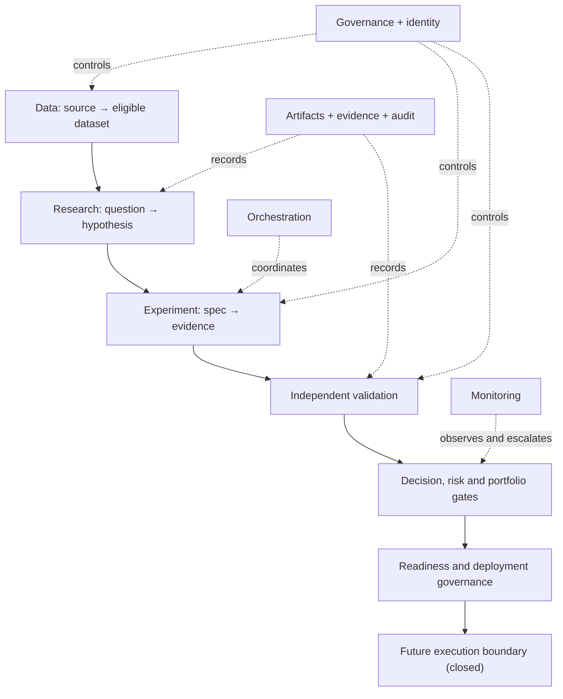

# AI Quant Lab — Module Boundary Architecture v1.0

## 1. Document Status

| Field | Value |
|---|---|
| Phase / Sprint | Phase 2 — Sprint 2 |
| Status | Proposed for governance review |
| Canonical path | `planning/MODULE_BOUNDARY_ARCHITECTURE_v1.md` |
| Constitutional authority | AI Quant Lab v1.0, tag `v1.0`, commit `50b61266f880cb9657b7f1b477d3d90825fe013f` |
| Planning authority | Implementation Planning Charter v1.0, merged by PR #50 at `82b683d252dba63cc7e8b0be44febef10eb5b7b3` |
| Architecture version | 1.0 |
| Implementation authority | None |
| Default module status | `PLANNED` |
| Deployment authority | None |

This document defines logical boundaries. It neither implements them nor amends the constitutional baseline or Charter.

## 2. Purpose

This architecture decomposes the future AI Quant Lab into governed modules whose responsibilities, evidence, dependencies, trust boundaries, authority interactions, failure containment, and future tests are explicit. It makes unsafe shortcuts structurally visible and gives Sprints 3–11 a stable planning surface.

The architecture is designed as a modular, evidence-driven, state-aware, governance-controlled research institution—not a monolithic strategy engine.

## 3. Authority and Inheritance

Every critical module must satisfy:

`CONSTITUTIONAL AUTHORITY → CHARTER REQUIREMENT → MODULE RESPONSIBILITY → EXPECTED ARTIFACT → FUTURE TEST`.

Authority descends only through governed delegation. Technical capability never creates authority. Where this architecture and a superior source conflict, the superior source wins and the affected module remains non-ready.

The hierarchy is:

1. AI Quant Lab v1.0 Constitutional Baseline;
2. Implementation Planning Charter v1.0;
3. this Module Boundary Architecture;
4. later Phase 2 plans;
5. future implementation specifications;
6. future executable implementation.

## 4. Scope

This document establishes:

- fifteen logical domains and forty-six canonical modules;
- control-plane and trust boundaries;
- preliminary authority, evidence, dependency, state, agent, and human mappings;
- prohibited shortcuts and authority loops;
- criticality and failure-containment expectations;
- lightweight architectural decisions;
- traceability obligations and open questions.

## 5. Non-Goals

This document does not provide code, executable schemas, APIs, endpoints, commands, databases, infrastructure, orchestration, quantitative methods, trading logic, parameters, optimization, backtesting, validation, monitoring, deployment, broker/exchange/TradingView connectivity, capital allocation, or autonomous execution.

It does not choose a language, vendor, runtime, storage engine, transport, user interface, or deployment topology. It does not classify any strategy as valid, safe, ready, or deployable.

## 6. Architectural Principles

1. **Constitution first.** No orphan critical module.
2. **Evidence before transition.** Assertion cannot substitute for admissible evidence.
3. **Identity is not authority.** Authentication does not imply permission.
4. **Production is not research.** Future execution is isolated behind explicit gates.
5. **Experiment is not validation.** Producers cannot validate their own result by default.
6. **Validation is not decision.** Validation evidence cannot self-promote.
7. **Decision is not deployment.** Executive authority remains bounded by readiness and deployment governance.
8. **Monitoring is observation.** Alerts cannot silently retune, reactivate, or expand scope.
9. **Orchestration coordinates authority.** It never creates it.
10. **Recording is not authorizing.** A ledger records decisions made elsewhere.
11. **Memory is admitted, not assumed.** Agent output is not automatically institutional knowledge.
12. **Fail closed.** Missing authority, lineage, eligibility, or evidence prevents promotion.
13. **Failure remains knowledge.** Rejected and invalidated work is preserved.
14. **No hidden mutation.** Data, evidence, artifacts, policy, scope, and state are versioned.
15. **Independent challenge.** Critical claims remain structurally challengeable.

## 7. Top-Level Architecture

The system has three architectural planes:

- **Governance Control Plane:** authority resolution, lifecycle eligibility, exceptions, escalation, identity, commands, decisions, risk and human gates.
- **Scientific Evidence Plane:** data, research, knowledge, experiments, validation, parity, artifacts, evidence, lineage and reproducibility.
- **Operational Coordination Plane:** workflows, dependencies, state recording, monitoring, alerts, recovery and future execution isolation.

Cross-cutting registries and ledgers serve all planes but cannot approve the actions they record.

## 8. Domain Map

| # | Domain | Boundary purpose |
|---|---|---|
| 1 | Governance | Resolve governing policy, gates, deviations and escalation |
| 2 | Identity & Authorization | Identify actors and independently resolve permissions |
| 3 | Data | Admit, preserve, qualify, transform and version data |
| 4 | Research | Register questions, hypotheses, evidence and challenge |
| 5 | Knowledge & Memory | Admit institutional knowledge and preserve failure/provenance |
| 6 | Experimentation | Specify, authorize, coordinate and package experiments |
| 7 | Validation | Independently challenge candidates and aggregate validation evidence |
| 8 | Decision | Organize evidence and exercise bounded decision authority |
| 9 | Risk Governance | Govern risk policy, assessment, escalation and suspension routing |
| 10 | Portfolio Governance | Admit candidates and assess portfolio interactions |
| 11 | Monitoring | Observe health, decay, incompatibility and violations |
| 12 | Orchestration | Coordinate work, prerequisites, transitions and recovery |
| 13 | Audit & Evidence | Preserve artifacts, evidence, lineage, decisions and transition history |
| 14 | Human Interface | Accept attributable commands and expose review/approval surfaces |
| 15 | Future Execution Boundary | Isolate all future capital-affecting capabilities |

## 9. Governance Control Plane

The control plane is intentionally split:

- **GOV-01 Authority & Policy Resolver** resolves applicable constitutional/planning rules and eligibility constraints.
- **GOV-02 Governance Exception & Escalation Gate** records deviations, violations, challenges, emergency routing, and required human authority.

This split prevents the resolver from approving its own exception. Lifecycle gates are enforced through GOV-01 in cooperation with IAM-02 and ORC-03; exceptions route through GOV-02. Neither module generates strategies, changes evidence, validates candidates, performs risk analysis, or impersonates human authority.

## 10. Identity & Authorization

- **IAM-01 Actor & Object Identity Registry** establishes canonical identities for humans, agents, workflows, artifacts, datasets, experiments, validation runs, decisions, commands, and actions.
- **IAM-02 Authorization Resolver** evaluates whether an identified actor may request, review, authorize, record, or execute a specified action within scope.

IAM-02 depends on IAM-01, governing policy, registry state, and human/agent contracts. IAM-01 cannot grant permission. IAM-02 cannot create identity, policy, or executive authority.

## 11. Data Architecture

The data chain is:

`DAT-01 Source Registry → DAT-02 Admission & Raw Custody → DAT-03 Quality & Temporal Integrity → DAT-04 Controlled Dataset Builder → DAT-05 Dataset Registry`.

Separation is retained because admission, immutable custody, quality eligibility, transformation, and version registration are different control points.

- DAT-01 records source identity, access conditions and provenance.
- DAT-02 admits external observations and preserves source-level material without silent repair.
- DAT-03 combines structural quality and temporal-integrity review because both determine admission eligibility, but it issues separate findings.
- DAT-04 applies only declared transformations to eligible inputs and emits lineage.
- DAT-05 assigns dataset identity, version, scope, lineage and eligibility status.

Raw observations cannot be overwritten by normalized data. A builder cannot mark its own output eligible without DAT-03 evidence and DAT-05 registration.

## 12. Research Architecture

- **RES-01 Research Intake & Question Registry** registers governed research requests and scope.
- **RES-02 Hypothesis Registry** holds falsifiable hypotheses, mechanisms, assumptions, scope and rejection criteria.
- **RES-03 Research Evidence & Challenge Boundary** preserves supporting and contradictory evidence and independent challenges.

Research may propose an experiment but cannot authorize execution, validate results, approve risk, or reach future execution.

## 13. Knowledge & Memory Architecture

- **KNW-01 Knowledge Registry** indexes admitted institutional knowledge and provenance.
- **KNW-02 Shared Memory Gateway** mediates governed reads/writes between transient actors and SMI.
- **KNW-03 Provenance, Failure & Learning Gate** preserves failed hypotheses, rejected experiments, invalidated strategies and contradictions, and controls their admission as learning.

The learning gate may admit a well-provenanced learning record; it cannot convert an unreviewed agent output into trusted knowledge. Provenance remains attributable and supersession never deletes history.

## 14. Experiment Architecture

The controlled path is:

`EXP-01 Intake & Specification → EXP-02 Dataset/Configuration Lock → EXP-03 Authorization Gate → EXP-04 Orchestration & Result Collection → EXP-05 Evidence Packager`.

- EXP-01 registers hypotheses, objectives, metrics, controls, scope and failure criteria.
- EXP-02 binds exact governed data, implementation, configuration and search context.
- EXP-03 checks prerequisites and authority; it does not judge performance.
- EXP-04 coordinates future execution and captures every trial/result/deviation.
- EXP-05 packages source outputs and failures without rewriting them.

EXP-04 and EXP-05 cannot validate, approve, rank for deployment, or hide failed trials.

## 15. Optimization Boundary

**EXP-06 Controlled Search Boundary** is a subordinate experimentation module for future parameter search, hyperparameter optimization, search-budget management and candidate ranking.

It must consume an authorized Experiment Specification and locked data/configuration. It must expose search space, objective history, budgets, seeds, all trials, failures, exclusions and amendments. It is prohibited from silently changing objectives or datasets, selecting final validation data, hiding trials, validating itself, or promoting candidates.

Optimization output is an Experiment Result input to EXP-05, never proof of robustness.

## 16. Validation Architecture

Validation is structurally separated from experimentation:

- **VAL-01 Validation Intake & Specification Registry** checks candidate eligibility and defines independent obligations.
- **VAL-02 Chronological Validation Boundary** covers future OOS, walk-forward and temporal-window evaluation.
- **VAL-03 Stochastic & Stress Validation Boundary** covers future Monte Carlo, perturbation and stress evidence.
- **VAL-04 Stability & Generalization Boundary** covers parameter stability, cross-market applicability, cost/execution sensitivity and failure zones.
- **VAL-05 Negative, Adversarial & Overfitting Defense Boundary** challenges leakage, multiple testing, narrative fitting, weak controls and accidental edge.
- **VAL-06 Validation Evidence Aggregator & Gate** references method evidence, limitations and contradictions and determines evidence completeness for downstream review.

Method modules cannot alter experiment artifacts or issue executive decisions. VAL-06 cannot rewrite source evidence, accept risk, or authorize deployment.

## 17. Implementation Parity Boundary

**VAL-07 Implementation Parity Boundary** compares governed representations at phase-specific checkpoints: reference specification, research implementation, engineering output, pre-paper, pre-limited-live, pre-live-active, post-remediation, and monitoring/control parity.

Inputs are versioned architecture/specification, implementation identities, data assumptions and expected behavior. Outputs are mismatch records, tolerance evidence and parity classification. Unknown, material, critical, blocking or invalidating differences prevent silent promotion. Parity is not validation of edge or deployment authority.

## 18. Decision Architecture

- **DEC-01 Decision Evidence Intake & Support** verifies package availability, scope, contradictions and limitations and organizes them without selecting non-delegable outcomes.
- **DEC-02 Executive Decision Gate** represents bounded constitutional decision authority and may issue approve, reject, hold, return or escalate outcomes only within evidence and authority scope.

DEC-02 cannot rewrite, backfill or suppress evidence. Approval does not bypass risk, readiness, portfolio applicability or deployment governance.

## 19. Risk Governance Architecture

- **RSK-01 Risk Policy & Assessment Boundary** preserves governed constraints and evaluates risk evidence without editing experiment or validation results.
- **RSK-02 Risk Escalation, Kill & Suspension Boundary** routes violations, containment, kill/suspension requests and required human authority.

RSK-02 may support authorized emergency containment, but cannot approve its own exception, silently relax constraints, validate a candidate, or create deployment authority.

## 20. Portfolio Governance Architecture

- **PRT-01 Portfolio Candidate Admission Gate** checks whether strategy scope and packages permit portfolio consideration.
- **PRT-02 Exposure, Dependency & Portfolio Decision Boundary** plans future correlation, concentration, overlap, tail, liquidity, capacity and shared-failure evidence and issues portfolio eligibility within PCS authority.

Individual validity does not imply portfolio eligibility. Portfolio eligibility is not risk acceptance or deployment approval.

## 21. Monitoring Architecture

- **MON-01 System, Data & Dependency Health Monitor** observes availability, quality, freshness and pipeline health.
- **MON-02 Strategy, Edge & Regime Health Monitor** observes governed baselines, decay, regime mismatch, costs, execution, capacity and portfolio interactions.
- **MON-03 Governance Monitor & Alert Router** detects missing evidence, unauthorized actions, stale authority and control violations and routes severity/escalation.

Monitors can observe, record, alert and request response. They cannot retune, reactivate, approve, expand scope or modify policy.

## 22. Orchestration Architecture

- **ORC-01 Workflow & Task Orchestrator** opens governed workflows, sequences work and routes tasks.
- **ORC-02 Dependency & Eligibility Coordinator** confirms prerequisites, versions, evidence and availability.
- **ORC-03 State, Recovery & Escalation Coordinator** submits transition requests, records authorized transitions, manages bounded retry/return/hold/quarantine and routes escalation.

ORC-03 records only an authorization produced by the appropriate gate. Orchestration cannot infer permission from technical success.

## 23. Audit & Evidence Architecture

- **AUD-01 Artifact Registry Boundary** governs artifact identity, version, ownership, freeze, amendment, supersession and consumers under ART.
- **AUD-02 Evidence Registry & Custody Boundary** governs evidence identity, provenance, admissibility, custody, contradiction and package references under EES.
- **AUD-03 Audit, Decision, State & Lineage Ledger** preserves attributable actions, decisions, transitions, lineage and reproducibility manifests.

Registries and ledgers cannot validate or decide the content they record. Aggregation references source evidence; it does not rewrite it.

## 24. Human Interface Architecture

- **HUM-01 Command & Status Gateway** receives attributable human commands and exposes governed status, lineage, failures and evidence requests.
- **HUM-02 Approval, Escalation & Emergency Interface** presents bounded review/approval/rejection/escalation/halt actions to authorized humans.

These are logical interfaces, not UI, API or CLI designs. They depend on IAM-01/02, CM, GOV-01/02 and audit recording. Human convenience cannot waive evidence or audit requirements.

## 25. Future Execution Boundary

**EXE-01 Future Execution Isolation Gateway** is a conceptual, closed boundary separating research/validation/governance from any future capital-affecting environment.

Its current status is `PLANNED_CLOSED`. It has no current execution capability or authority. Any future opening requires separately governed evidence, validation, risk, executive decision, portfolio applicability, production readiness, deployment governance, monitoring, response readiness and explicit human authority.

No current module may place orders, connect to brokers/exchanges, allocate capital, activate paper/live operation, or treat EXE-01 as an implementation commitment.

## 26. Canonical Module Inventory

All modules are version 1.0 and status `PLANNED`, except EXE-01 which is `PLANNED_CLOSED`.

| ID | Module | Domain | Criticality | Primary responsibility | Authority source |
|---|---|---|---|---|---|
| GOV-01 | Authority & Policy Resolver | Governance | C3 | Resolve applicable policy and eligibility | CM, WOE, SLS, Charter |
| GOV-02 | Exception & Escalation Gate | Governance | C4 | Govern deviations, violations and escalation | CM, EDRP, IOP |
| IAM-01 | Actor & Object Identity Registry | Identity | C3 | Canonical identities | AR, ART, SMI |
| IAM-02 | Authorization Resolver | Identity | C4 | Resolve action permission by scope | AR, CM, agent contracts |
| DAT-01 | Data Source Registry | Data | C2 | Source identity and provenance | DQS |
| DAT-02 | Admission & Raw Custody | Data | C2 | Controlled admission and raw preservation | DQS, ART |
| DAT-03 | Quality & Temporal Integrity | Data | C2 | Quality and temporal eligibility evidence | DQS, ODS |
| DAT-04 | Controlled Dataset Builder | Data | C2 | Declared transformations and lineage | DQS, FFS |
| DAT-05 | Dataset Registry | Data | C2 | Versioned dataset identity and eligibility | DQS, ART |
| RES-01 | Research Intake & Question Registry | Research | C1 | Research request identity and scope | ARP, CM |
| RES-02 | Hypothesis Registry | Research | C1 | Falsifiable hypothesis custody | ARP, EDS |
| RES-03 | Research Evidence & Challenge | Research | C2 | Supporting/contradictory evidence and challenge | EDS, EES |
| KNW-01 | Knowledge Registry | Knowledge | C2 | Admitted knowledge index | Knowledge OS |
| KNW-02 | Shared Memory Gateway | Knowledge | C2 | Governed shared-state access | SMI |
| KNW-03 | Provenance, Failure & Learning Gate | Knowledge | C2 | Failure memory and controlled learning | Knowledge OS, IOP |
| EXP-01 | Experiment Intake & Specification | Experiment | C2 | Governed experiment definition | XDS |
| EXP-02 | Dataset & Configuration Lock | Experiment | C2 | Bind versions and assumptions | XDS, DQS, IPS |
| EXP-03 | Experiment Authorization Gate | Experiment | C3 | Check prerequisites and execution eligibility | XDS, WOE |
| EXP-04 | Experiment Orchestration & Results | Experiment | C2 | Coordinate future run and capture outputs | WOE, XDS |
| EXP-05 | Experiment Evidence Packager | Experiment | C2 | Produce EEP-ready package | EEP, EES |
| EXP-06 | Controlled Search Boundary | Experiment | C2 | Govern future search and candidate ranking | XDS, PSS, ODS |
| VAL-01 | Validation Intake & Specification | Validation | C3 | Eligible intake and obligations | VEP, WFRS |
| VAL-02 | Chronological Validation Boundary | Validation | C2 | OOS, WF and temporal evidence | WFRS |
| VAL-03 | Stochastic & Stress Boundary | Validation | C2 | Monte Carlo and stress evidence | MCSTS |
| VAL-04 | Stability & Generalization Boundary | Validation | C2 | Stability and scope evidence | PSS, WFRS |
| VAL-05 | Negative, Adversarial & ODS Boundary | Validation | C3 | Independent challenge and overfitting defense | ODS |
| VAL-06 | Validation Aggregator & Gate | Validation | C3 | Aggregate without rewriting; issue completeness | VEP, EES |
| VAL-07 | Implementation Parity Boundary | Validation | C3 | Versioned parity checkpoints | IPS |
| DEC-01 | Decision Evidence Intake & Support | Decision | C3 | Organize admissible decision inputs | DOS, EDP |
| DEC-02 | Executive Decision Gate | Decision | C4 | Bounded executive outcomes | EDP |
| RSK-01 | Risk Policy & Assessment | Risk | C4 | Govern constraints and risk evidence | RRP |
| RSK-02 | Risk Escalation, Kill & Suspension | Risk | C4 | Route breaches and containment authority | RRP, EDRP |
| PRT-01 | Portfolio Candidate Admission | Portfolio | C3 | Eligibility for PCS review | PCS |
| PRT-02 | Exposure & Portfolio Decision | Portfolio | C4 | Portfolio interaction evidence/classification | PCS |
| MON-01 | System, Data & Dependency Health | Monitoring | C3 | Operational/data health observation | MEDS, DQS |
| MON-02 | Strategy, Edge & Regime Health | Monitoring | C4 | Decay and incompatibility observation | MEDS, EDRP |
| MON-03 | Governance Monitor & Alert Router | Monitoring | C4 | Violation detection and escalation | MEDS, EDRP |
| ORC-01 | Workflow & Task Orchestrator | Orchestration | C3 | Sequence and route governed work | WOE |
| ORC-02 | Dependency & Eligibility Coordinator | Orchestration | C3 | Verify prerequisites | WOE, PRC |
| ORC-03 | State, Recovery & Escalation Coordinator | Orchestration | C4 | Record authorized transitions and recovery | WOE, SLS |
| AUD-01 | Artifact Registry Boundary | Audit | C3 | Artifact identity and lifecycle custody | ART |
| AUD-02 | Evidence Registry & Custody | Audit | C3 | Evidence provenance and custody | EES |
| AUD-03 | Audit, Decision, State & Lineage Ledger | Audit | C4 | Reconstruct actions and transitions | EES, SMI, IOP |
| HUM-01 | Command & Status Gateway | Human Interface | C3 | Attributable commands and status | CM |
| HUM-02 | Approval, Escalation & Emergency Interface | Human Interface | C4 | Human authority actions | CM, EDRP |
| EXE-01 | Future Execution Isolation Gateway | Execution boundary | C4 | Closed separation from capital effects | DGS, PRC |

## 27. Module Contract Standard and Contract Catalogue

### 27.1 Universal contract fields

For every inventory entry:

- **Identity:** the table ID, name, v1.0 and domain are canonical.
- **Authority:** cited sources are inherited, never self-created.
- **Status:** `PLANNED`; no module is `IMPLEMENTATION_READY`.
- **State:** modules may observe and request only listed domain-relevant transitions; authorization is reserved to named gates/humans; arbitrary mutation is prohibited.
- **Audit:** every material input, output, rejection, decision request, failure and escalation must reference identity, scope, authority, evidence and timestamp.
- **Future tests:** identity, contract, authorization, evidence completeness, prohibited-transition, failure, recovery and audit-reconstruction tests are mandatory, scaled by criticality.

### 27.2 Contract catalogue — allowed work and outputs

| Module group | Inputs accepted | Inputs rejected | Outputs / evidence produced | Explicit non-responsibilities |
|---|---|---|---|---|
| GOV-01/02 | Identified command, policy, state, evidence refs | Unknown actor/scope; self-issued exception | Policy resolution, gate/exception/escalation record | Research, validation, evidence editing, self-approval |
| IAM-01/02 | Identity claims, contracts, requested action/scope | Anonymous or ambiguous actor/object | Identity record; authorization decision | Policy creation, executive decision |
| DAT-01..05 | Identified sources, raw observations, declared transforms | Unknown source, silent mutation, future-contaminated input | Source/raw/QC/lineage/dataset records | Hypothesis, experiment conclusion, validation |
| RES-01..03 | Commanded question, evidence, scope, challenge | Hidden intent, unsupported authority | Research question, hypothesis, evidence/challenge record | Experiment authorization, validation, promotion |
| KNW-01..03 | Provenanced reviewed records | Unattributed agent output, mutable unknown source | Knowledge, memory, provenance, failure/learning record | Truth declaration, evidence rewriting |
| EXP-01..06 | Hypothesis, eligible dataset, spec, authority | Unlocked data/config, hidden objective/search | Specification, lock, trial/result/deviation, EEP inputs | Validation, risk, decision, deployment |
| VAL-01..07 | Frozen candidate/evidence, independent specification | Producer assertion alone, mutable OOS, unknown implementation | Method reports, contradiction/mismatch, VEP inputs | Experiment editing, risk acceptance, deployment |
| DEC-01/02 | Issued evidence packages and authority scope | Missing/contradictory evidence concealed | Intake record; bounded decision record | Evidence rewriting, readiness/deployment substitution |
| RSK-01/02 | VEP/EDP/PCS context, policy, breaches | Self-approved exception, altered results | RRP inputs, limits, escalation/containment request | Validation, executive decision |
| PRT-01/02 | Eligible strategy packages and portfolio scope | Unvalidated/broadened scope | Admission, exposure and portfolio evidence/classification | Strategy validation, risk/deployment approval |
| MON-01..03 | Baselines, observed telemetry/evidence/status | Unknown baseline, silent threshold changes | Health/decay/violation/alert evidence | Retuning, reactivation, policy change |
| ORC-01..03 | Authorized commands, dependencies, decisions | Missing authority/evidence; illegal transition | Workflow/task/eligibility/transition/recovery records | Authority creation, substantive validation |
| AUD-01..03 | Attributable artifacts/evidence/actions/decisions | Unversioned, unprovenanced, unauthorized mutation | Registry and immutable audit references | Approval, validation, source rewriting |
| HUM-01/02 | Authenticated human intent within scope | Impersonation, ambiguous or unauthorized command | Command, approval/rejection/escalation/halt record | Automatic policy waiver, hidden override |
| EXE-01 | In Phase 2: governance boundary definitions only | Any order/capital/connectivity request | Closed-boundary status and rejection evidence | All execution and deployment |

### 27.3 Dependencies, interactions, failure and escalation

| Module group | Mandatory upstream | Permitted downstream | Prohibited dependency/shortcut | Failure containment and escalation |
|---|---|---|---|---|
| GOV | IAM, constitutional sources, AUD | All gates and ORC | Experiment/validation result as authority | Fail closed; GOV-02 + human governance |
| IAM | AR/ART/agent contracts, AUD | Every controlled module | Identity implying authority | Reject/quarantine ambiguous identity |
| DAT | IAM, GOV, AUD | RES, EXP, VAL | Direct raw-to-experiment bypass | Quarantine dataset; DQS escalation |
| RES | IAM, GOV, DAT, AUD | EXP intake, KNW | Direct decision/execution | Return/challenge; research owner |
| KNW | IAM, AUD, EES/SMI | RES, all readers | Transient memory as truth | Hold admission; curator/human review |
| EXP | IAM, GOV, DAT, RES, AUD, ORC | VAL intake | Direct DEC/EXE; self-validation | Stop/return; preserve partial/failed trials |
| VAL | IAM, GOV, AUD; frozen EXP evidence | DEC, RSK, PRT | Mutable experiment control; self-promotion | Inconclusive/fail; independent escalation |
| DEC | IAM, GOV, AUD, VEP/RRP/PCS as applicable | PRC/DGS planning boundary | Direct evidence mutation or EXE | HOLD/RETURN/REJECT/ESCALATE |
| RSK | IAM, GOV, AUD, VEP/EDP/PCS | DEC/DGS/EDRP paths | Risk exception approved by assessor | Fail closed; human escalation/suspension |
| PRT | IAM, GOV, AUD, VEP/RRP | DEC/PRC | Individual result as diversification proof | Reject/return portfolio candidate |
| MON | IAM, AUD, baselines | EDRP/RSK/HUM/ORC | Alert-to-retune/reactivate | Alert, contain request, stale-monitor halt |
| ORC | IAM, GOV, AUD, all prerequisites | Assigned modules | Workflow success as authorization | bounded retry, return, hold, escalate |
| AUD | IAM, source modules | All consumers | Registry as approving authority | freeze/quarantine; audit escalation |
| HUM | IAM, GOV, AUD | Appropriate gates/ORC | UI convenience bypass | reject and log; emergency containment only |
| EXE | EDP/RRP/PCS/PRC/DGS/MEDS/EDRP + human authority in future | Future execution only | Any research direct link | remain closed; reject and escalate |

### 27.4 Human, agent and state interaction

Agents may produce or request only within their contracts. Human interaction occurs at GOV-02, DEC-02, RSK-02, HUM-02 and any future DGS/PRC boundary. Transition authorizers are not inferred from the module that computes, routes or records evidence.

All modules observe only necessary states. RES and EXP may request progression; VAL may validate evidence readiness and recommend/return; DEC and bounded human governance may authorize decision states; RSK/EDRP authorities may request or authorize containment within scope; ORC-03 records the authorized transition; AUD-03 preserves it. EXE-01 authorizes nothing in Phase 2.

## 28. Dependency Graph

Mandatory cross-cutting dependencies are IAM, governance resolution, artifact/evidence custody and audit. Optional analytical dependencies may be added only if they cannot change authority. Prohibited shortcuts are listed in Section 39.

No circular approval dependency is permitted. Evidence may return for challenge, but a feedback loop must create a new version and cannot overwrite its source.

## 29. Interaction Matrix

The matrix covers major module families; detailed pairwise expansion belongs to later interface plans.

| From \ To | GOV/IAM | DAT | RES/KNW | EXP | VAL | DEC/RSK/PRT | MON | ORC | AUD | HUM | EXE |
|---|---|---|---|---|---|---|---|---|---|---|---|
| GOV/IAM | REQUIRED | REQUIRED | REQUIRED | REQUIRED | REQUIRED | REQUIRED | REQUIRED | REQUIRED | REQUIRED | REQUIRED | INDIRECT ONLY |
| DAT | REQUIRED | REQUIRED | PERMITTED | REQUIRED | REQUIRED | INDIRECT ONLY | REQUIRED | PERMITTED | REQUIRED | INDIRECT ONLY | PROHIBITED |
| RES/KNW | REQUIRED | REQUIRED | REQUIRED | REQUIRED | INDIRECT ONLY | INDIRECT ONLY | PERMITTED | REQUIRED | REQUIRED | PERMITTED | PROHIBITED |
| EXP | REQUIRED | REQUIRED | PERMITTED | REQUIRED | REQUIRED | INDIRECT ONLY | PERMITTED | REQUIRED | REQUIRED | PERMITTED | PROHIBITED |
| VAL | REQUIRED | REQUIRED | PERMITTED | INDIRECT ONLY | REQUIRED | REQUIRED | PERMITTED | REQUIRED | REQUIRED | PERMITTED | PROHIBITED |
| DEC/RSK/PRT | REQUIRED | INDIRECT ONLY | INDIRECT ONLY | INDIRECT ONLY | REQUIRED | REQUIRED | REQUIRED | REQUIRED | REQUIRED | REQUIRED | INDIRECT ONLY |
| MON | REQUIRED | PERMITTED | PERMITTED | PERMITTED | PERMITTED | REQUIRED | REQUIRED | REQUIRED | REQUIRED | REQUIRED | PROHIBITED |
| ORC | REQUIRED | PERMITTED | PERMITTED | REQUIRED | REQUIRED | REQUIRED | REQUIRED | REQUIRED | REQUIRED | PERMITTED | PROHIBITED |
| AUD | REQUIRED | PERMITTED | PERMITTED | PERMITTED | PERMITTED | PERMITTED | PERMITTED | PERMITTED | REQUIRED | PERMITTED | INDIRECT ONLY |
| HUM | REQUIRED | INDIRECT ONLY | PERMITTED | PERMITTED | PERMITTED | REQUIRED | REQUIRED | REQUIRED | REQUIRED | REQUIRED | INDIRECT ONLY |
| EXE | REQUIRED | INDIRECT ONLY | PROHIBITED | PROHIBITED | PROHIBITED | INDIRECT ONLY | REQUIRED | REQUIRED | REQUIRED | REQUIRED | NOT APPLICABLE |

`INDIRECT ONLY` means interaction must pass through the relevant governed gate and evidence path. It does not permit a direct command or state mutation.

## 30. Trust Boundaries

| ID | Boundary | What crosses | Required identity/evidence/authority | Failure behavior |
|---|---|---|---|---|
| TB-01 | External Data | Source observations and metadata | Source identity, access condition, provenance, admission record | Reject/quarantine; no research use |
| TB-02 | Autonomous Agent | Proposal, analysis, artifact or command | Agent identity, contract, scope, provenance | Return/reject; record unauthorized action |
| TB-03 | Transient Memory | Candidate memory update | Producer, source evidence, review and learning gate | Keep transient; do not institutionalize |
| TB-04 | Research to Experiment | Hypothesis and specification request | Hypothesis record, eligible data plan, XDS prerequisites | Return to research |
| TB-05 | Experiment to Validation | Frozen result/evidence package | EEP, versions, lineage, independence | Inconclusive/reject intake |
| TB-06 | Validation to Authority | VEP and contradictions | Issued evidence, scope, IAM authorization | HOLD/RETURN; no implicit approval |
| TB-07 | Research/Governance to Future Execution | Only future authorized deployment package | VEP, RRP, EDP, PCS if applicable, PRC, DGS, MEDS/EDRP, human authority | Gateway remains closed; escalate |

Every crossing is auditable through AUD-03. Passing a boundary does not broaden scope.

## 31. Authority Flow

| Capability | Architectural holders | Meaning |
|---|---|---|
| CAN PRODUCE | DAT, RES, KNW, EXP, VAL, MON, AUD | Produce bounded artifacts/evidence |
| CAN REQUEST | Identified agents/humans through HUM/ORC | Ask for a governed action or transition |
| CAN VALIDATE | VAL boundaries and constitutionally assigned validators | Evaluate evidence within validation scope |
| CAN RECOMMEND | RES, VAL, DEC support, RSK, PRT, MON | Non-binding bounded recommendation |
| CAN AUTHORIZE | IAM-confirmed constitutional/human gates, including DEC-02 and bounded risk/emergency gates | Issue a governed authority decision |
| CAN RECORD | ORC-03 and AUD modules | Persist an already authorized state/action |
| CAN EXECUTE | No Sprint 2 module | Future capability only behind EXE-01 |

The same module may hold several capabilities only where the constitutional source permits it and segregation controls remain intact.

## 32. Evidence Flow

`SOURCE EVIDENCE → DATA QUALITY EVIDENCE → RESEARCH EVIDENCE → EXPERIMENT EVIDENCE → VALIDATION EVIDENCE → RISK / PORTFOLIO EVIDENCE → DECISION EVIDENCE → MONITORING / RESPONSE EVIDENCE`.

AUD-02 preserves custody and references. AUD-03 preserves lineage and decisions. Aggregators EXP-05 and VAL-06 assemble references, limitations and contradictions; they cannot rewrite source evidence. Every transformation creates a new attributable artifact and retains the predecessor.

## 33. State Ownership

Architectural roles are distinct:

- **Observer:** reads governed state; does not mutate it.
- **Transition requester:** proposes a legal transition with evidence.
- **Transition validator:** checks preconditions/evidence; does not necessarily approve.
- **Transition authorizer:** exercises constitutional authority within scope.
- **State recorder:** persists the authorized result and audit trail.

ORC-03 and AUD-03 are recorders, not default authorizers. Detailed state names, mappings and legal transitions are deferred to Sprint 4.

## 34. Segregation of Duties

| Combination | Classification | Control |
|---|---|---|
| Proposer + researcher | ALLOWED | Evidence and hypothesis remain challengeable |
| Researcher + experiment designer | ALLOWED WITH CONTROLS | Independent experiment authorization and validation |
| Experiment designer + experimenter | ALLOWED WITH CONTROLS | Locked specification; full deviations/trials visible |
| Experimenter + validator of same candidate | PROHIBITED | Independent VAL ownership required |
| Validator + executive approver | PROHIBITED for same decision path | DEC-02 separate authority |
| Risk assessor + exception approver | PROHIBITED | GOV-02/HUM-02 independent authority |
| Monitor + alert router | ALLOWED WITH CONTROLS | Cannot retune, reactivate or authorize |
| Orchestrator + state recorder | ALLOWED WITH CONTROLS | Must reference external authorization |
| Artifact/evidence custodian + decision authority | PROHIBITED | Custody cannot decide substance |
| Human reviewer + approver | ALLOWED WITH CONTROLS where constitution permits | Identity, scope, conflict and audit required |
| Operator + emergency containment initiator | ALLOWED WITH CONTROLS | Risk-reducing only; immediate record and review |
| Propose + experiment + validate + approve | PROHIBITED | Circular self-approval |

Sprint 5 will assign named actors; Sprint 2 guarantees that separate boundaries exist.

## 35. Failure Containment

| Failure | Default containment | Permitted next action |
|---|---|---|
| Corrupt/unknown data | Quarantine at DAT-02/03 | Reconcile source or supersede dataset |
| Missing/stale evidence | Fail closed at gate | Return for new evidence |
| Invalid state/transition | Reject request | Escalate to GOV-02 if disputed |
| Unauthorized command | Reject and audit | Security/governance review |
| Agent failure | Preserve partial work; stop dependent tasks | Reassign through ORC with provenance |
| Orchestration failure | Hold workflow; do not infer completion | Bounded retry or human escalation |
| Validation disagreement | Preserve all findings; classify conflicted | Challenge/review; no promotion |
| Dependency outage | Degrade/hold affected scope | Recovery verification before resume |
| Monitoring failure | Treat health as unknown | Escalate; constrain affected operation |
| Memory inconsistency | Quarantine disputed update | Provenance reconciliation |
| Conflicting decisions | Hold state; preserve both records | Authorized conflict resolution |
| Incomplete lineage | Evidence inadmissible | Reconstruct or reject |
| Parity failure | Block represented scope | Engineering return and revalidation |
| Audit failure | Stop critical transition | Restore auditability before progression |

Retry must never mutate frozen inputs or erase an earlier attempt. Suspension cannot self-expire. Recovery does not equal reactivation.

## 36. Criticality Classification

- **C0 — Informational:** failure has limited governance impact.
- **C1 — Research Critical:** failure may distort questions or hypotheses.
- **C2 — Evidence Critical:** failure may invalidate evidence, lineage or reproducibility.
- **C3 — Governance Critical:** failure may permit an invalid gate or transition.
- **C4 — Safety / Capital Critical:** future failure could affect deployment, risk, suspension or capital.

C2 requires strong provenance, repeatability and independent evidence tests. C3 adds authorization, prohibited-transition and fail-closed testing. C4 adds highest assurance, independent review, containment, redundancy planning and explicit human authority. No C4 module is implementation-ready in Sprint 2.

## 37. Agent Integration

| Constitutional agent | May interact with | Must not control | Evidence it may produce / request |
|---|---|---|---|
| Quant Strategy Architect | RES, KNW, EXP-01, AUD | VAL, DEC-02, RSK, EXE | Architecture/hypothesis; experiment request |
| Market Research Agent | DAT read, RES, KNW, AUD | EXP authorization, VAL, decisions | Market evidence and research observations |
| Research Librarian Agent | KNW, RES-03, AUD | Knowledge admission alone, validation | Sourced evidence/provenance |
| Knowledge Curator Agent | KNW-01/03, AUD | Rewrite source evidence, decisions | Curation/learning recommendation |
| Quant Strategy Engineer | EXP specs, VAL-07, AUD | Hypothesis change, self-parity acceptance, deployment | Versioned implementation artifacts in future; parity remediation |
| Experiment Orchestrator Agent | EXP, ORC, AUD | VAL authority, decision, risk | Run/deviation/result evidence |
| Validation Agent | VAL, DAT evidence, AUD | Experiment mutation, risk/executive authority | Independent validation/challenge evidence |
| Risk Governance Agent | RSK, PRT evidence, HUM escalation | Validation rewriting, executive decision | Risk assessment, limits, escalation |
| Executive Decision Agent | DEC-01/02, HUM, AUD | Rewrite evidence, bypass PRC/DGS | Bounded decision record |

This mapping does not amend any contract. Detailed RACI and unresolved operational ownership remain Sprint 5 work.

## 38. Human Authority

Likely non-delegable or explicitly human-governed actions include constitutional amendment, approval of governance exceptions, executive decisions where required, risk exception acceptance, production/readiness/deployment authority, emergency override beyond pre-authorized containment, reactivation, retirement, and conflict resolution between issued authorities.

- **Human review:** inspect/challenge; no automatic state authority.
- **Human approval:** explicit scoped authorization through HUM-02.
- **Human override:** exceptional, attributable, bounded, time-limited and reviewed; cannot rewrite evidence.
- **Human emergency action:** may reduce risk before full review; cannot expand authority.
- **Human governance amendment:** follows constitutional change control outside ordinary Phase 2.

No agent or interface may impersonate human authority.

## 39. Prohibited Shortcuts

The architecture prohibits:

- Research → Deployment or EXE-01;
- Raw Data → Research/Experiment without DAT-03 and DAT-05;
- Mutable or unknown Dataset → final validation;
- Experiment → Approval;
- Experiment/Optimization → Validation classification;
- Optimization → Production;
- EXP-04/06 → hidden objective, dataset, trial or OOS change;
- Validation Engine → self-approval or evidence rewriting;
- Validation → deployment authority;
- Evidence Registry/Aggregator → Decision authority;
- Identity Registry → Authorization;
- Authorization Resolver → policy creation;
- Decision Support → non-delegable decision;
- Risk Assessor → its own exception;
- Portfolio eligibility → risk/deployment approval;
- Monitoring Alert → retuning, reactivation or scope expansion;
- Orchestrator → authority creation;
- State Recorder → transition approval;
- Agent Output → trusted institutional knowledge;
- Shared Memory → evidence without provenance;
- Execution capability → governance override;
- Emergency containment → permanent authority;
- Human convenience → missing audit trail;
- Failed/rejected artifact → deletion;
- Aggregated evidence → silent source replacement.

## 40. Architectural Decision Records

| ADR | Decision | Alternatives | Reason / governance consequence | Trade-off / reversibility / downstream |
|---|---|---|---|---|
| ADR-001 | Separate Governance Resolution from Exception Approval | One control module | Prevent self-waiver | More handoffs; reversible only with governance proof; affects Sprint 4/5 |
| ADR-002 | Separate Identity from Authorization | Combined IAM | Identity must not imply permission | Extra resolution step; foundational to commands/tests |
| ADR-003 | Separate Raw Custody, Quality and Dataset Registry | Single data engine | Prevent silent mutation/self-eligibility | More artifacts; enables DQS traceability |
| ADR-004 | Separate Experiment from Validation | Unified research engine | Independent challenge and no self-approval | Higher coordination cost; constitutionally required |
| ADR-005 | Treat Optimization as subordinate Experimentation | Independent optimizer authority | Search success is not robustness | Limits autonomy; supports ODS/PSS |
| ADR-006 | Separate Evidence Custody from Decision Authority | Decision-owned evidence store | Decisions cannot rewrite evidence | Additional references; improves auditability |
| ADR-007 | Separate Monitoring from Retuning/Reactivation | Autonomous response engine | Observation is not change authority | Slower response; safe containment still possible |
| ADR-008 | Separate State Recording from Authorization | Orchestrator-owned state | Prevent technical side effect becoming approval | Requires explicit authority reference |
| ADR-009 | Keep Future Execution as closed boundary | Omit until implementation | Prevent research-to-capital bolt-on | Abstract now; critical future safeguard |
| ADR-010 | Combine related validation methods into four method boundaries | One module per method or one monolith | Balance independence/evidence clarity against fragmentation | Refinable in Sprint 9; source reports remain separate |

All decisions are technology-neutral and reversible through controlled planning change unless constitutional constraints make the separation mandatory.

## 41. Traceability Matrix

| Constitutional / planning requirement | Module(s) | Future artifact | Future test obligation |
|---|---|---|---|
| No authority without identity/scope | IAM-01/02, GOV-01 | Identity and authorization records | Unknown actor, scope and denied-action tests |
| No data use without DQS/lineage | DAT-01..05 | Source, QC, lineage, dataset records | Corruption, temporal leakage, mutation and reconstruction tests |
| Research proposes, does not validate | RES-01..03 | Hypothesis/evidence/challenge | Prohibited transition to validation/decision |
| Memory requires provenance | KNW-01..03 | Knowledge/failure/learning records | Unattributed-output rejection and supersession |
| Experiment requires XDS and frozen context | EXP-01..05 | Spec, lock, result, EEP | Dataset/config drift and failed-trial visibility |
| Optimization is not validation | EXP-06 | Search history/result | Hidden trial/objective/OOS selection tests |
| Independent validation | VAL-01..06 | Method reports and VEP | Producer-validator conflict and evidence completeness |
| Implementation representations require parity | VAL-07 | Parity/mismatch record | Phase-checkpoint and blocking mismatch tests |
| Evidence does not become decision | DEC-01/02, AUD-02 | Intake and EDP decision | Missing/contradictory evidence and rewrite prevention |
| Risk cannot self-waive | RSK-01/02, GOV-02 | RRP/escalation/exception | Self-exception and silent-limit-relaxation tests |
| Portfolio eligibility is separate | PRT-01/02 | PCS admission/exposure record | Scope, correlation and authority substitution tests |
| Monitoring cannot silently retune | MON-01..03 | Health/decay/alert record | Alert-to-change prohibited-transition test |
| Orchestration creates no authority | ORC-01..03 | Workflow/transition record | Missing authority and recorder-authorizer separation |
| Artifacts/evidence remain attributable | AUD-01..03 | Registry, ledger, manifest | Freeze, amendment, lineage and reconstruction |
| Human commands are attributable | HUM-01/02 | Command/approval/emergency record | Authentication, authorization and override audit |
| No research-to-execution shortcut | EXE-01 | Closed-boundary/rejection record | Direct-call, missing-gate and capital-action rejection |

No critical module is architecturally orphaned. Full citation-level expansion is required in Sprint 12.

## 42. Open Architecture Questions

| ID | Question | Affected modules | Source | Severity | Blocking | Decision owner | Resolution / target |
|---|---|---|---|---|---|---|---|
| A-OQ-001 | Exact cross-domain lifecycle mapping? | GOV, ORC, all gates | WOE/SLS/ARP/packages | Major | No for Sprint 2 | Sprint 4 owner | State inventory and mapping in Sprint 4 |
| A-OQ-002 | Exact human/hybrid ownership of specialized operational gates? | GOV, RSK, PRT, MON, HUM | Phase 1.5, AR | Major | No | Sprint 5 governance | Responsibility matrix; no new agent authority |
| A-OQ-003 | Minimum artifact/evidence contract fields and package composition? | AUD, all producers | ART/EES | Major | No | Sprint 3 owner | Non-executable contracts in Sprint 3 |
| A-OQ-004 | Whether DAT-03 later needs separate structural and temporal implementations? | DAT-03 | DQS/ODS | Minor | No | Sprint 7 owner | Preserve separate findings; evaluate load/independence |
| A-OQ-005 | Exact independence rules among VAL method boundaries? | VAL-01..07 | VEP/WFRS/MCSTS/PSS/ODS/IPS | Major | No | Sprint 5/9 owners | Define actor separation and method ownership |
| A-OQ-006 | Which future readiness/deployment modules sit between DEC/RSK/PRT and EXE-01? | DEC, RSK, PRT, EXE | PRC/DGS | Major | No now; blocking before implementation readiness | Later module/Phase 2 integration review | Map in later plans without implementing |
| A-OQ-007 | Legal/security/licensing authority for external dependencies and data? | DAT, IAM, HUM, EXE | DQS/PRC/repository license | Major | No for Sprint 2 | Human governance | Inventory in Sprint 7; block affected implementation if unresolved |

Blocking architecture questions: **0**. All questions are bounded and assigned to later planning gates.

## 43. Sprint Acceptance Assessment

| Criterion | Result | Evidence |
|---|---|---|
| Domains established | PASS | 15-domain map |
| Canonical inventory | PASS | 46 modules |
| Responsibilities/non-responsibilities | PASS | Sections 9–27 |
| Trust boundaries | PASS | 7 boundaries |
| Authority/evidence flows | PASS | Sections 31–32 |
| Dependencies and shortcuts | PASS | Graph, matrix and 23 shortcut classes |
| Segregation structurally possible | PASS | Section 34 |
| State ownership defined | PASS | Section 33 |
| Failure containment | PASS | Section 35 |
| Criticality model | PASS | C0–C4 |
| Agent/human boundaries | PASS | Sections 37–38 |
| ADRs | PASS | 10 planning ADRs |
| Open questions registered | PASS | 7; none blocking |
| Critical traceability | PASS | 16 critical chains |
| Constitutional meaning unchanged | PASS | No constitutional file modification |
| Charter meaning unchanged | PASS | Charter unmodified |
| Executable implementation absent | PASS | Documentation-only architecture |

Sprint 2 is coherent. Non-blocking questions remain intentionally deferred to their authorized planning sprints.

## 44. Final Architecture Declaration

This architecture establishes AI Quant Lab as a governed scientific research institution expressed through modular boundaries. It prevents idea generation from becoming experiment authority, experiment success from becoming validation, validation from becoming executive/risk/deployment authority, monitoring from becoming retuning, and technical execution capability from becoming governance.

Every canonical module has an inherited reason to exist, a bounded responsibility, prohibited behavior, evidence and audit obligations, dependency controls, state interaction limits, failure containment, criticality and future tests. No module is implementation-ready merely because its boundary is defined.

**Sprint decision: `SPRINT 2 COMPLETE WITH OPEN ARCHITECTURE ITEMS`.**

Subject to governance review and acceptance, the next authorized step is:

**Phase 2 — Sprint 3: Artifact & Evidence Contract System**

This declaration authorizes planning only. It does not authorize implementation, validation of any strategy, paper/live trading, deployment, production operation, capital allocation, risk acceptance, proof of edge, safety claims or future-performance claims.
